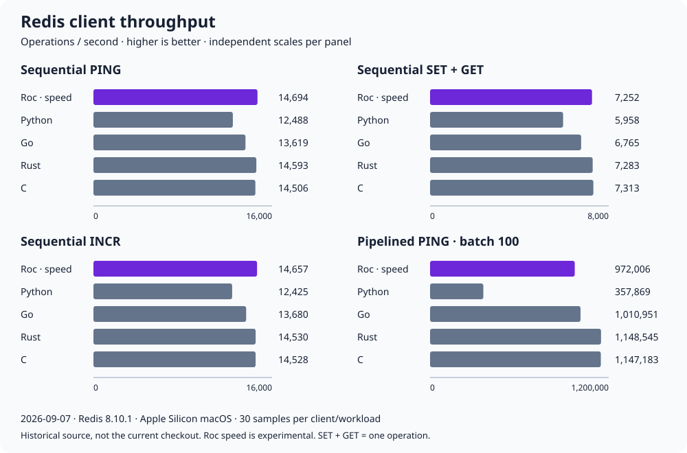

# roc-redis

A binary-safe, platform-agnostic Redis client for Roc. Pure command construction
and RESP2 decoding; your platform supplies the byte-stream effects.

**Community preview:** targets `nightly-2026-09-07-14d9829`. Use the dev backend
by default; speed and size remain experimental. The API is open to feedback.

- Typed APIs for **405 commands across 18 families**, plus raw constructors.
- Custom reply decoders, ordered pipelines, and distinct RESP2 null types.
- Bounded incremental parsing and explicit transport, server, and decoder errors.
- Examples for basic-cli and basic-webserver; the core depends on neither.

## Get started

The example below targets **0.1.0-rc1** and the pinned Roc nightly above.
Save it as `main.roc`. With Roc and Redis available (the checkout's
`nix develop` supplies both), start disposable Redis in a separate terminal:

```sh
redis-server --bind 127.0.0.1 --port 6379 --save "" --appendonly no
```

Then run `roc --opt=dev main.roc`. Each run appends `!` to a UTF-8 greeting
and saves it for 60 seconds:

```roc
app [main!] {
	pf: platform "https://github.com/roc-lang/basic-cli/releases/download/0.23.0-rc1/3hT3SoHZ6qbEsa9qVFLUW3547U5LeoNd1KbpqLpz4r1i.tar.zst",
	redis: "https://github.com/jaredramirez/roc-redis/releases/download/0.1.0-rc1/D8HziVQtZBUBer5ASdLDqwsFwXwZ2pV5XNQ9C21urvTZ.tar.zst",
}

import pf.Tcp
import pf.Stdout
import pf.OsStr exposing [OsStr]
import redis.Bytes
import redis.Commands
import redis.Config
import redis.Connection

Ok(config) = Config.default |> Config.build

main! : List(OsStr) => Try({}, [ExampleFailed(Str), Exit(I32), ..])
main! = |_args| {
	stream = Tcp.connect!("127.0.0.1", 6379, 2_000)
		? |error| ExampleFailed("connect: ${Str.inspect(error)}")
	connection : Connection(_, _)
	connection = {
		config: config,
		read!: |max_bytes| stream.read_up_to!(max_bytes, 2_000)
			.map_ok(|bytes| if bytes.is_empty() End else Data(bytes)),
		write_all!: |bytes| stream.write!(bytes, 2_000),
	}
	stored = connection.request!(Commands.Strings.get("example:greeting"))
		? |error| ExampleFailed("GET: ${Str.inspect(error)}")
	greeting = match stored {
		Present(bytes) => bytes.to_utf8() ? |_| ExampleFailed("greeting is not UTF-8")
		Absent => "Hello"
	}
	updated = Bytes.from_str("${greeting}!")
	_ = connection.request!(
		Commands.Strings.set("example:greeting", updated, { expiration: Seconds(60) }),
	) ? |error| ExampleFailed("SET: ${Str.inspect(error)}")
	Stdout.line!("${greeting}!") ? |error| ExampleFailed("stdout: ${Str.inspect(error)}")
	Ok({})
}
```

Missing keys start with `"Hello"`; invalid UTF-8 and request failures are reported.
**This is not atomic:** another writer can change the value between GET and SET.
Use APPEND or a transaction/script for coordinated updates. Run this example
only against disposable data; stop Redis with Ctrl-C when finished.

[Installation details](docs/INSTALL.md) ·
[Checkout-local example](examples/read_modify_write.roc) ·
[Custom decoders and batches](examples/composition.roc)

## Bring your own transport

Your application owns the connection, TLS, deadlines, and exclusive access.
`read!` returns at most the requested bytes; `write_all!` must accept the whole
buffer. Discard the connection after `ExchangeFailed`; execution may be ambiguous.

`connection.request!` handles one request. `connection.batch!` pipelines requests in
one exchange, with `Batch.each` preserving each result. Batching is not a transaction.
Reply suppression has a separate, explicitly unsafe `Execute.no_reply!` API.
The wrapper does not enforce ownership or invalidate aliases after failure.
Unbound `Execute.request!` and `Execute.batch!` remain available for adapters.

The core includes no RESP3, automatic retries, cluster routing, or connection pool.
The [minimal Zig pooling example](examples/pooling/README.md) demonstrates
platform-owned pooling; it is not a production concurrent pool.
[Full API, transport contract, and failure guarantees →](docs/usage.md)

## Benchmarks



Historical September 7 campaign: Redis 8.10.1 over loopback on Apple Silicon
macOS, 5,000 operations/sample, 30 samples per client/workload across ten balanced
orders. **Higher operations/second is better.** SET+GET counts as one operation;
pipelines contain 100 PINGs.

Roc used the experimental speed backend and basic-cli 0.22.2. These results
predate subsequent decoder changes and the platform upgrade; they are not a
measurement of the current checkout or a general language ranking.
Roc used a wall-clock timer; other clients used monotonic timers.

[Exact values and chart provenance](docs/benchmark-chart.md) ·
[Workloads and reproduction](benchmarks/README.md) ·
[Performance learnings](perf.md)

```console
nix run .#benchmark
```

## Explore and contribute

- [Module map](docs/modules.md) and [complete command coverage](metadata/typed-command-api.tsv)
- [Validation status](QUALITY-REVIEW.md), [platform pins](docs/PLATFORM-UPGRADE.md), and [compiler repros](roc-bugs/)
- [API feedback questions](docs/COMMUNITY-FEEDBACK.md) and [contributing](CONTRIBUTING.md)

Licensed under [Apache 2.0](LICENSE). See [NOTICE](NOTICE) and
[third-party provenance](THIRD_PARTY.md).
